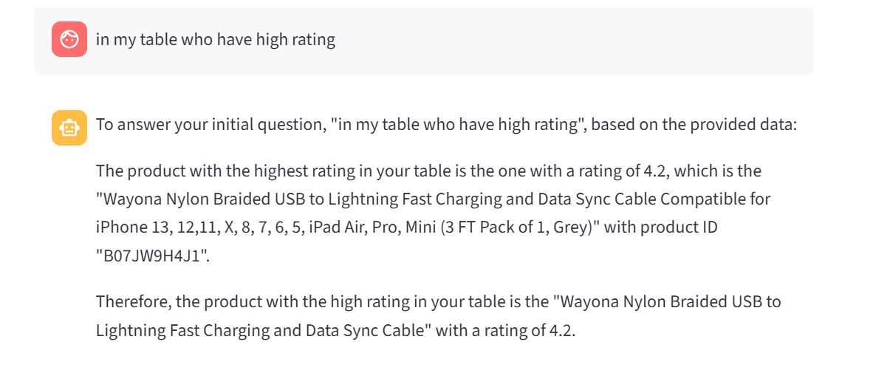
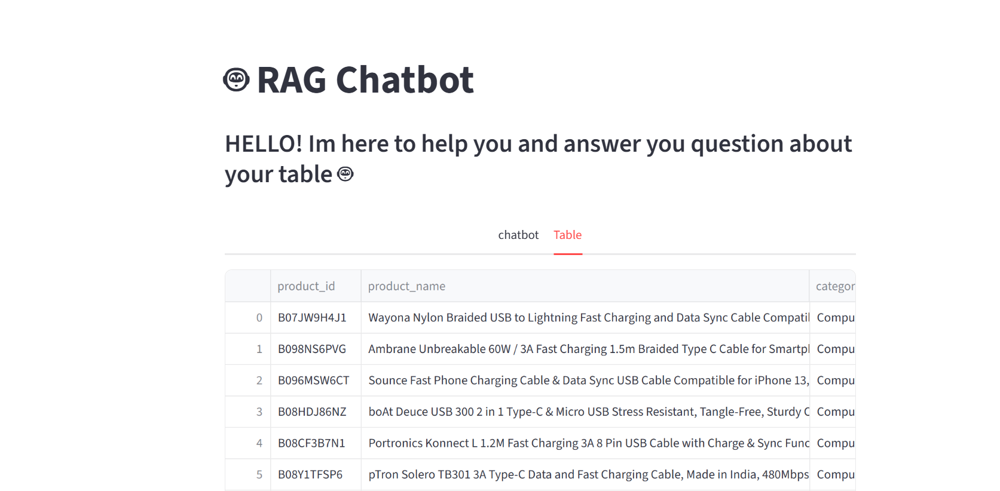
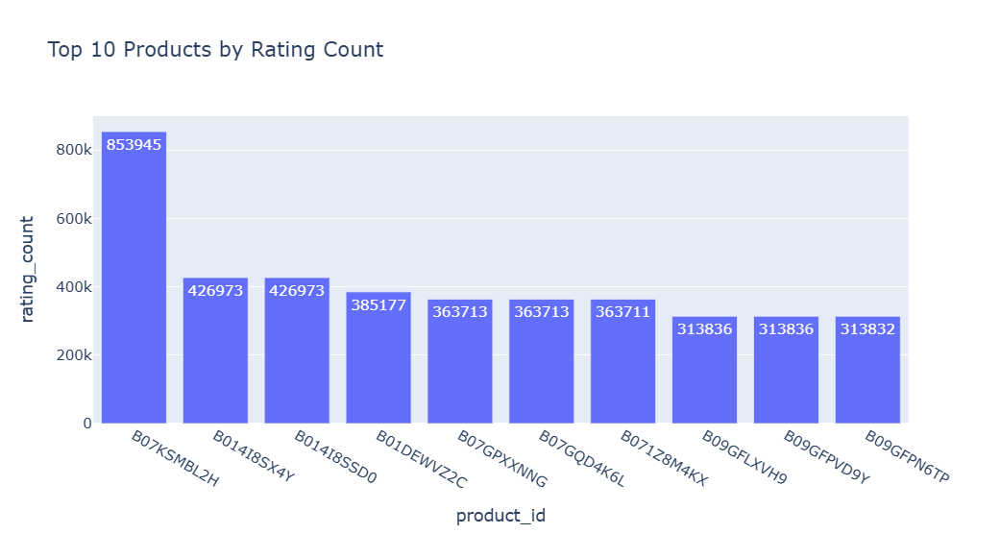
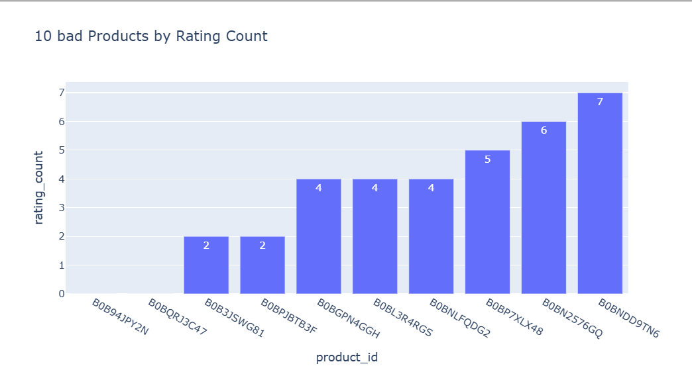
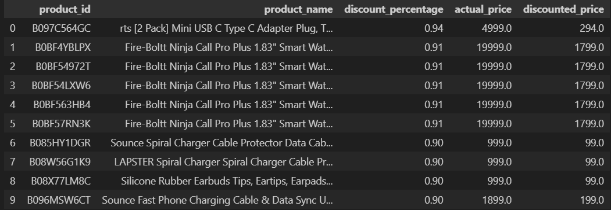
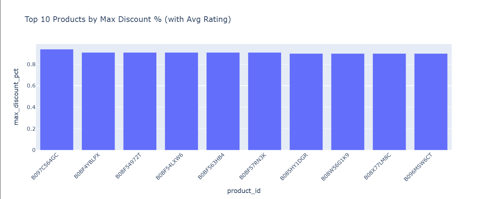

# 🤖 RAG Chatbot with Table QA & Sentiment Analysis


An interactive **RAG Chatbot** built with **Groq API** and **Streamlit**, capable of answering user questions directly from an uploaded **SQLite/Excel dataset**, with integrated **Sentiment Analysis** on customer reviews (`review_content`).  
The chatbot previews your table, runs analysis, and uses **LLM reasoning** to provide insights in real-time.

---

## Table of Contents
- [Visual Demo](#visual-demo)  
- [Project Overview](#project-overview)  
- [Data Source](#data-source)  
- [Data Analysis Notebook](#data-analysis-notebook)  
- [Features](#features)  
- [Technology Stack](#technology-stack)  
- [Requirements](#requirements)  
- [Installation](#️-installation)  
- [Author](#author)  
- [License](#license)

---

## 📷 Visual Demo





### 🔹 more analysis and visulastion
<summary>click here to see more analysis</summary>
<details>
⭐ Best & Worst Products
- **Top 10 Good Products**
  
  

- **Top 10 Bad Products**
  
  

---

📈 Category Insights
- **Average Sales by Category**
  
  

---

⭐ Ratings
- **Max Rating and max Rating Count**
  
  

---

💰 Discounts
- **Top 10 Discounts**

  

  **Visual**
  
  

  </details>

---

## 📖 Project Overview

This project is a **Retrieval-Augmented Generation (RAG) Chatbot** that integrates:  
- **Groq’s LLMs** for conversational intelligence.  
- **Streamlit** for an interactive user interface.  
- **SQLite/Excel dataset** as the knowledge base.  
- **Sentiment Analysis** on the `review_content` column.  

The chatbot can:  
- Load data from your table.  
- Preview the dataset.  
- Answer natural language questions about it.  
- Detect **positive, negative, or neutral sentiment** in product reviews.  

---

## 📊 Data Source

The chatbot connects with a **local SQLite database** (`amazon.db`) .  
The demo uses the table **`amazon_review`** containing Amazon product reviews.

### Dataset Columns
<details>
<summary>click here to see all column</summary>

| Column              | Description |
|---------------------|-------------|
| `product_id`        | Unique product identifier |
| `product_name`      | Name of the product |
| `category`          | Full category hierarchy (e.g., *Computers > Accessories*) |
| `discounted_price`  | Discounted price of the product |
| `actual_price`      | Original price before discount |
| `discount_percentage` | Percentage discount applied |
| `rating`            | User rating (1–5) |
| `rating_count`      | Number of ratings received |
| `about_product`     | Product description |
| `user_id`           | Unique identifier for reviewer |
| `user_name`         | Name of the reviewer |
| `review_id`         | Unique review identifier |
| `review_title`      | Title of the review |
| `review_content`    | Full review text (used for **sentiment analysis**) |
| `img_link`          | Link to product image |
| `product_link`      | Link to product page |
| `+Primary category`  | Extracted top-level product category |
| `+sentiment_score`   | Numerical sentiment score (from VADER) |
| `+sentiment_label`   | Label derived from sentiment score (`positive`, `negative`, `neutral`) |

**" + " is new column**

</details>

---

## 📒 Data Analysis Notebook

📂 `excel_analysis.ipynb`  

The Jupyter Notebook includes:  
- Exploratory Data Analysis (EDA).  
- Cleaning text fields (`review_content`, `about_product`, `user_name`, `review_title`).  
- **Sentiment Analysis** using **NLTK VADER** on `review_content` → generates `sentiment_score` and `sentiment_label`.  
- Feature engineering: **Primary Category extraction**.  
- Visualizations: rating distribution, sentiment breakdown, and category insights.  

---

## 🚀 Features
- **Chatbot Tab:** Conversational assistant that answers questions using your table.  
- **Table Tab:** Explore raw table data interactively.  
- **Sentiment Analysis:** Detects emotions (positive, negative, neutral) in reviews.  
- **RAG Powered:** Uses Groq’s LLM with table grounding.  
- **Data Preview:** Sends only limited rows to the LLM (avoids token overload).  
- **Simple UI:** Built with Streamlit for quick deployment.  
- **Jupyter Notebook Analysis:** Provides deeper insights.  

---

## 🛠 Technology Stack

### 🔧 Technologies
- **Python 3.10** – Core programming language  
- **SQLite3** – Local database  
- **Streamlit** – Web interface  
- **Groq API** – LLM inference  
- **Jupyter Notebook** – Data exploration and analysis  

---

## 📦 Requirements

The project requires the following Python libraries:

- `pandas` - Data manipulation and analysis  
- `numpy` - Numerical operations  
- `plotly` - Interactive data visualizations  
- `streamlit` - Web application framework  
- `groq` - Groq API client for LLM integration  
- `nltk` - Natural Language Toolkit (used for Sentiment Analysis with VADER)  
- `sqlite3` - Lightweight relational database (built into Python, may require `sqlite3-binary` in some environments)  
- `python-dotenv` - Load environment variables from `.env` file  

### NLTK Resources
Make sure to download the **VADER lexicon** before running sentiment analysis:

```python
import nltk
nltk.download('vader_lexicon')
```

---

## ⚙️ Installation
- **IN TERMINAL**

1. Clone the repository:
   ```bash
   git clone https://github.com/ibrahim-alatyan/RAG-Chatbot-with-Table-QA-Sentiment-Analysis.git
   cd RAG-Chatbot-and-Sentiment-Analysis

2. Install the required libraries:
    ```bash
    pip install -r requirements.txt

3. Make .env file:
    ```bash
    GROQ_API_KEY=your_api_key_here

4. Run the app(**IN TERMINAL**):
    ```bash
    streamlit run src/chatbot.py

    OR

    python -m streamlit run src/chatbot.py

---

## 👨‍💻 Author
- Ibrahim Al-Atyan

---

## 📄 License
This project is released under the **MIT License**.  
See the [LICENSE](LICENSE) file for more details.
